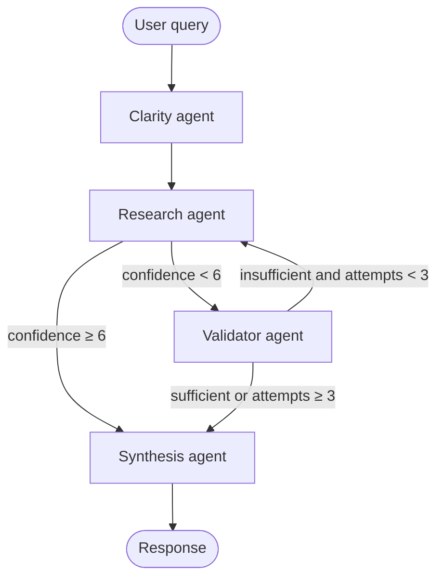

# Multi-Agent Business Research Assistant

A production-grade LangGraph multi-agent system that helps users research businesses using specialized, collaborating AI agents.

## Architecture



Clarity may call `interrupt()` inside the node when the query is ambiguous; after `Command(resume=…)` the graph always continues **Clarity → Research** (see ``app/graph.py`` and ``app/utils/hitl.py``).

Flow summary (matches ``app/graph.py``):

- **Clarity → Research** (always, after any HITL resume).
- **Research → Synthesis** if ``confidence_score >= 6``; **Research → Validator** if below 6.
- **Validator → Research** if ``insufficient`` and ``research_attempts < 3``; **Validator → Synthesis** if ``sufficient`` **or** ``research_attempts >= 3`` (max attempts).
- **Synthesis → END**.

**Clarity routing vs a two-branch diagram.** Some specs draw separate “Interrupt” and “Research” nodes. Here, **ambiguous queries call `interrupt()` inside the Clarity node**; the graph pauses until the CLI sends `Command(resume=…)`, then the same node enriches `user_query` and the graph always follows **Clarity → Research**. Behavior matches “interrupt or research”; only the *shape* of the graph differs.

## Agents

| Agent | Role | Output |
|-------|------|--------|
| **Clarity Agent** | Checks if the query is specific enough and has a company name | `clarity_status`: `clear` or `needs_clarification` (original LLM verdict); `clarification_resolved` is `True` after HITL |
| **Research Agent** | Searches via Tavily (`TAVILY_TRANSPORT=sdk` or `mcp`) | `research_findings` + `confidence_score` (0–10) |
| **Validator Agent** | Evaluates research quality and completeness | `validation_result`: `sufficient` or `insufficient` |
| **Synthesis Agent** | Generates a clean, structured final answer | Final markdown response |

## Setup

### 1. Install dependencies

```bash
pip install -r requirements.txt
# optional: editable install so ``import app`` is explicit in any cwd
pip install -e .
```

### 2. Configure environment variables

Copy `.env.example` to `.env` and fill in your keys:

```bash
cp .env.example .env
```

Required keys:
- `GROQ_API_KEY` — from [console.groq.com/keys](https://console.groq.com/keys)
- `TAVILY_API_KEY` — from [tavily.com](https://tavily.com) (free tier available)

Optional (see `.env.example`):

- **`TAVILY_TRANSPORT=mcp`** — use Tavily’s **remote MCP** (streamable HTTP) instead of the Python SDK. Default is `sdk`.
- **LangSmith** — set `LANGCHAIN_TRACING_V2=true` and `LANGCHAIN_API_KEY` to record traces (no extra code paths required).
- **Checkpointing** — default is on-disk SQLite under `.checkpoints/`; set `LANGGRAPH_CHECKPOINT_BACKEND=memory` for ephemeral runs.

### 3. Run

```bash
# Interactive CLI (recommended for demo)
python main.py

# Or run the quick demo with preset queries
python demo.py
```

## Project Structure

```
research_assistant/
├── pyproject.toml       # Package metadata + pytest config (pythonpath)
├── main.py              # CLI entrypoint (imports ``app``)
├── demo.py              # Scripted demo entrypoint
├── app/                 # Installable application package
│   ├── __init__.py
│   ├── config.py
│   ├── state.py
│   ├── graph.py
│   ├── llm.py
│   ├── checkpointing.py
│   ├── observability.py
│   ├── agents/
│   │   ├── clarity.py
│   │   ├── research.py
│   │   ├── validator.py
│   │   └── synthesis.py
│   ├── tools/
│   │   ├── search.py
│   │   └── mcp_tavily.py
│   └── utils/
│       ├── display.py
│       └── hitl.py
├── tests/
│   ├── test_routing.py
│   └── test_integration_mocked.py
├── requirements.txt
├── .env.example
├── AI_PROMPTS.md
└── README.md
```

All domain logic lives under **`app/`** so the repo root stays thin (entrypoints, tests, and docs only).

## Features

- **Multi-turn conversation** — full history maintained across queries
- **Human-in-the-loop** — LangGraph ``interrupt()`` pauses when a query is ambiguous; the CLI resumes with ``Command(resume=...)`` (see ``app/utils/hitl.py``)
- **Retry loop** — Validator can send Research Agent back for better data (max 3 attempts)
- **Confidence scoring** — Research Agent self-scores its findings 0–10
- **Rich terminal UI** — colored output with agent status indicators
- **Graceful fallback** — max retries hit → proceeds to Synthesis anyway

## Production notes

### Checkpointing

By default the graph uses **SQLite** (`langgraph-checkpoint-sqlite`) at `LANGGRAPH_SQLITE_PATH` (default `.checkpoints/langgraph.sqlite`). Set `LANGGRAPH_CHECKPOINT_BACKEND=memory` for ephemeral sessions (used in fast unit/integration tests when `MemorySaver` is injected).

### Observability

- **Application logs** — `main.py` / `demo.py` call `observability.setup_application_logging()`. Tune `LOG_LEVEL` and set `JSON_LOGS=1` for log aggregation–friendly JSON lines.
- **Graph turn breadcrumbs** — `main.py` and `app/utils/hitl.py` log invoke / interrupt / resume with `thread_id`.
- **LangSmith** — enable `LANGCHAIN_TRACING_V2` and `LANGCHAIN_API_KEY` for full LLM/tool traces (LangChain picks these up automatically).

### Tests

```bash
pytest tests/ -q
```

Routing tests do not need API keys. Integration tests mock the Groq client and Tavily search.

### Tavily MCP vs SDK

Set `TAVILY_TRANSPORT=mcp` to call Tavily through the **official remote MCP** URL (see [Tavily MCP docs](https://docs.tavily.com/documentation/mcp)). Each search opens a short MCP session (fine for demos); for maximum throughput keep `TAVILY_TRANSPORT=sdk` (default).

```
You: Tell me about Apple
You: What about their competitors?          ← follow-up using history
You: Who is the CEO of the company?         ← ambiguous (triggers clarification)
You: What are Tesla's latest financials?
You: exit
```
